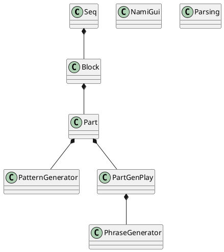
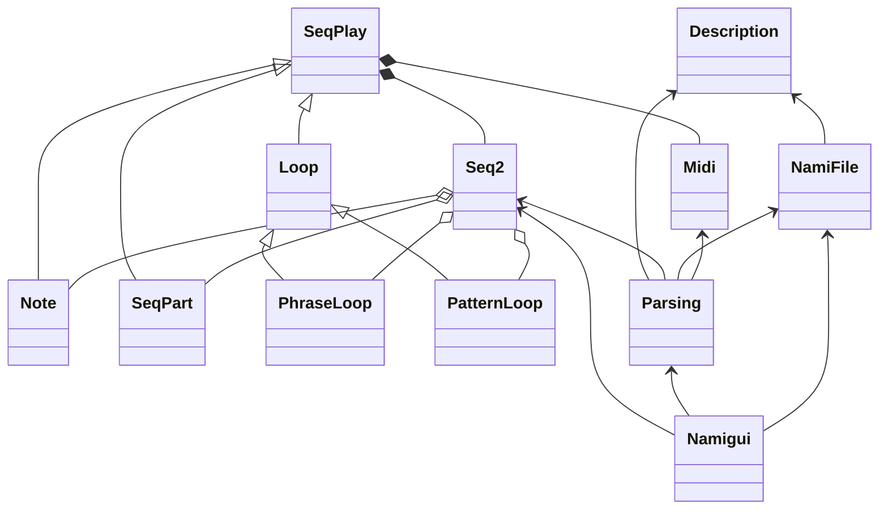

# Namihey design

## Class Design

<!--

-->

### Parsing
- File: namiparse.py
- Role: 入力コマンドのパース処理

### NamiFile
- File: namifile.py
- Role: Load/Save コマンド処理、チェーンロード処理

### Description
- File: namidscrpt.py
- Role: 入力されたパターンテキストの内容を整備し、Block に渡す仕組みを提供する

### Seq2
- File: namiseq2.py
- Role: タイミング管理

### SeqPlay
- File: namiseqply.py
- Role: Sequencer 内のインスタンスを生成するための Super Class

### Loop
- File: namiseqply.py

### Note
- File: namiseqply.py

### SeqPart
- File: namiseqpart.py

### PhraseGenerator
- File: namiphrase.py
- Role: 入力データから MIDI シーケンスを生成する処理

### PatternGenerator
- File: namiseqptn.py

### PhraseLoop(sqp.Loop):

### PatternLoop(sqp.Loop):

### NamiGui
- File: namigui.py
- Role: pygame を用いて、別windowによる各種情報の表示を行う

### Log
- File: namilib.py
- Role: デバッグ用のログ書き出しサービスを提供する
    - nlib.log.record(文字列) を書けば、時間情報込みで log.txt に出力される

---------------

## Thread

### Main Thread
- Main Loop: NamiGui(): main_loop()
- Role: pygame GUI の表示

### Cui Thread
- Main Loop: namihey.py: cui()
- Role: コンソールでの Keyboard 入力受付とCUI表示

### Event Generator Thread
- Main Loop: namihey.py: generate_ev()
- Role: MIDI 出力用の周期処理