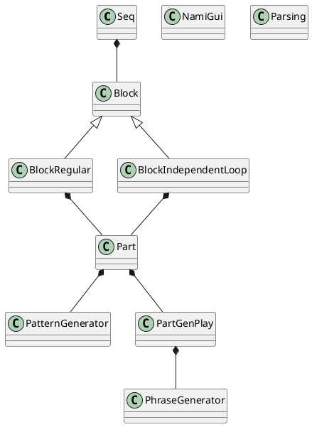
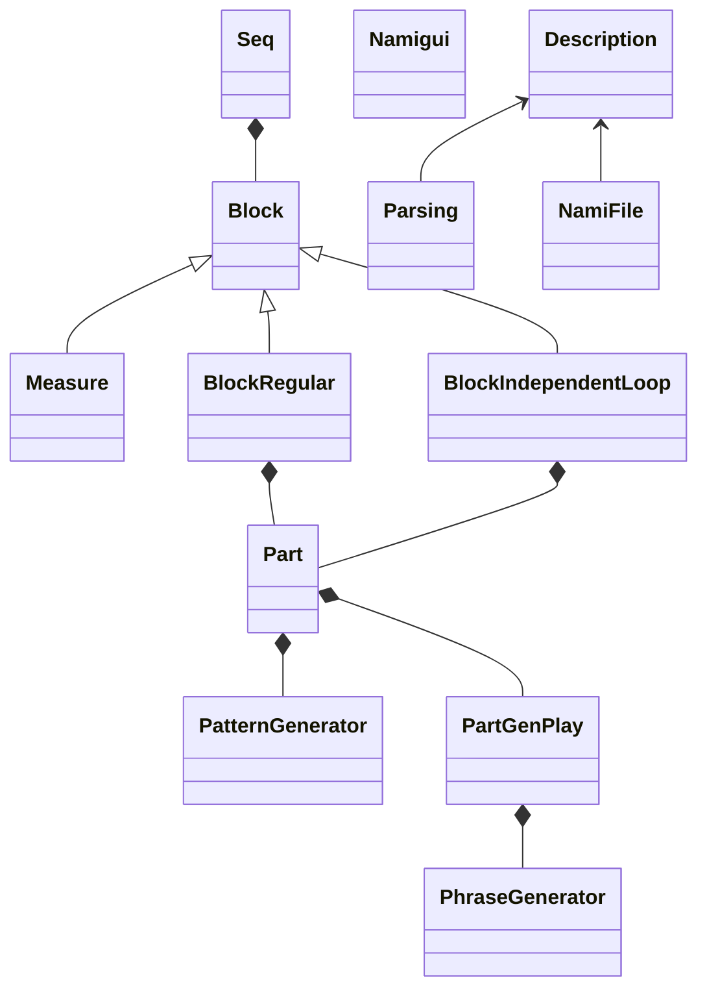

# Namihey design

## Class Design

<!--

-->

### Parsing
- File: namiparse.py
- Role: 入力コマンドのパース処理

### NamiFile
- File: namifile.py
- Role: Load/Save コマンド処理、チェーンロード処理

### Description
- File: namidscrpt.py
- Role: 入力されたパターンテキストの内容を整備し、Block に渡す仕組みを提供する

### Seq
- File: namiseq.py
- Role: 複数ブロックのタイミング管理、MIDI PORT設定、chain load制御
- Note:
    - あくまでタイミングは時間で管理し、小節や tick という概念は、このクラスでは扱わない
    - ブロックは、Regular と Independent の二種類を一つずつ生成する
    - MIDI PORT の設定を行う
    - chain load 時、ファイルからの Description を呼び出す制御を行う
- Variables:
    - self.during_play          : 再生中か
    - self.start_time           : start したときの絶対時間
    - self.current_time         : start から現在までの経過時間(startからの相対時間)
    - self.next_time            : 次回再生イベントがある時間(startからの相対時間)
    - self.latest_clear_time    : 前回再生イベントがあった時間(startからの相対時間)
- Methods:
    - def _calc_max_measure():
        - この中で、各パートの return_to_top() をコールし、各パートの最大tickから最大小節数を算出
    - def periodic()
        - generate_ev() から呼ばれ続ける別スレッドの関数

### Measure
- File: namiblock.py
- Role: ブロックの小節と時間の管理
- Variables:
    - self.tick_for_one_measure     : [１小節のtick数, 分子, 分母]

### Block
- File: namiblock.py
- Role: 各パートが独立したループを持つブロック
- Note:
    - 全パートが同時にスタートする時 ev_time が 0 に初期化され、そこからの相対時間が記録される
    - 各パートは、パターンが開始された時間を ev_time からの相対値として looptop_msr に記録する
    - 小節の頭で小節数と絶対時間を記録し、また各パートはそのときのループの位置も把握する。これによって、再生中にテンポを変えられるようにする。

### Part
- File: namipart.py
- Role: パート内の、シーケンスデータ生成オブジェクトによるデータ生成と、再生コントロール
- Note:
    - Part IF を提供し、シーケンスの生成オブジェクトをコール
    - シーケンス生成オブジェクトには、oneByOne と atOnce の2typeがある

### PartGenPlay
- File: namiptgen.py
- Role: ユーザーが入力したデータから、その場で MIDI シーケンスを生成し、再生コントロールするオブジェクト(atOnce型)
- Note:
    - 実際には、内部で PhraseGenerator オブジェクトを呼び出して、このオブジェクトにシーケンスを作ってもらう

### PhraseGenerator
- File: namiphrase.py
- Role: 入力データから MIDI シーケンスを生成する処理
- Note:
    - PartGen からコールされる

### PatternGenerator
- File: namipattern.py
- Role: ユーザーが入力したデータをもとに、再生時に逐次シーケンスを生成し、再生コントロールするオブジェクト(oneByOne型)
    - Random 型と Arpeggio 型の二つのタイプがある

### NamiGui
- File: namigui.py
- Role: pygame を用いて、別windowによる各種情報の表示を行う

### Log
- File: namilib.py
- Role: デバッグ用のログ書き出しサービスを提供する
    - nlib.log.record(文字列) を書けば、時間情報込みで log.txt に出力される

---------------

## Thread

### Main Thread
- Main Loop: NamiGui(): main_loop()
- Role: pygame GUI の表示

### Cui Thread
- Main Loop: namihey.py: cui()
- Role: コンソールでの Keyboard 入力受付とCUI表示

### Event Generator Thread
- Main Loop: namihey.py: generate_ev()
- Role: MIDI 出力用の周期処理